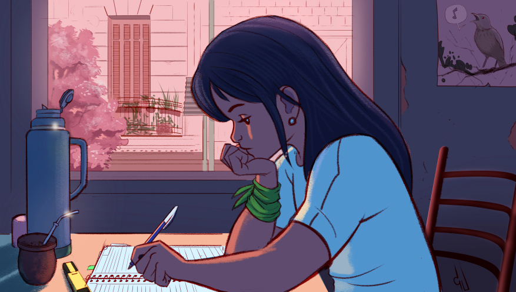

# Radio en YouTube con Raspberry Pi y OBS

¿Viste la radio de hip hop lo-fi en YouTube? Vamos a montar eso en un Raspberry Pi.

_Lo-fi Girl cortesía de [@CJ_Camba](https://twitter.com/cj_camba/)_

## ¿Qué necesitamos?

- Un Raspberry Pi, idealmente un RPi 3 Model B+ o superior.
- Transformador MicroUSB 5v con suficiente amperaje para nuestro modelo de RPi.
- Lectora de memorias MicroSD.
- Memoria MicroSD de 8+ GB.

Y además...

- Conocimientos de Linux.
- Mucha paciencia.

## ¿Qué tiene este proyecto de especial?

Transmitir por Internet no es difícil: si solamente quisiéramos pasar música o videos podríamos instalar FFMpeg (un software de línea de comandos para manipular pistas de audio y video) y configurar una transmisión en cinco minutos. Pero las radios de YouTube son más complejas: muestran el nombre del artista y el título del tema que está sonando, combinan imágenes y GIFs animados, reproducen canales de chat de Discord, muestran notificaciones animadas de suscripción, etcétera.

Para armar algo así tenemos varias opciones interesantes: podríamos desarrollar una interfaz con nuestro lenguaje favorito y configurar FFMpeg para capturar la ventana y transmitirla, o podríamos armar una aplicación web para aprovechar las capacidades gráficas del browser. Incluso podríamos ponernos retro y armar una interfaz de línea de comandos que vaya imprimiendo sucesivamente los textos que queremos mostrar.

Pero evitemos complicarnos la vida.

El estándar de facto es Open Broadcast Studio, un software de código abierto para armar transmisiones en vivo a través de una interfaz gráfica, que hace todo lo que necesitamos y más. OBS tiene un ecosistema enorme de plugins para integrar todo tipo de medios a nuestra transmisión: desde webcams hasta feeds de Twitter. Por desgracia OBS no es compatible con RPi ni hay interés en que lo sea, así que vamos a tener que compilar todo desde cero.

Este artículo está inspirado en un [thread del foro de Open Broadcast Studio](https://obsproject.com/forum/threads/obs-raspberry-pi-build-instructions.115739/), que fue el primer y último intento serio de correr OBS en un RPi hasta ahora. Los scripts están basados en el trabajo de [Xbelanch](https://github.com/xbelanch/OBS4Pi).

## ¿Qué onda el Raspberry Pi?

Es una computadora para hobistas con procesador ARM (la misma arquitectura que usa la mayoría de los celulares Android) del tamaño de un paquete de cigarrillos.

Hay una docena de modelos distintos, pero el más común (RPi 3 Model B+) sale 35 dólares, tiene cuatro núcleos, 1GB de RAM, lectora de tarjetas MicroSD, cuatro puertos USB, WiFi, Bluetooth, Ethernet, salida HDMI y jack de audio de 3.5mm que además funciona como salida de video analógico. Aparte tiene 40 pines GPIO para conectar componentes electrónicos. Se alimenta por puerto MicroUSB igual que un celular, y consume 2A andando al 100%.

Esto último está bueno porque podemos tener un RPi transmitiendo 24/7 sin que nos arranquen la cabeza con la boleta de luz.

Las posibilidades de una cajita que corre Linux, se conecta con cualquier dispositivo imaginable y transmite por YouTube son infinitas: armar una radio es solamente la punta del iceberg.

## El plan de acción

Vamos a compilar OBS y un puñado de dependencias. Como el RPi no tiene ninguna capacidad de aceleración gráfica, vamos a correr OBS en modo software, así que olvidémosnos de transmitir en fullHD: vamos a apuntar a 720p a <10 FPS, que para una radio alcanza y sobra. Si necesitamos más rendimiento, hay RPis más potentes, pero son más caros.

## Paso 1: Armar el Raspberry Pi

Esto no es un tutorial sobre RPi, así que vamos a hacerla corta: bajamos una imagen específica de Raspbian, la distro oficial de Linux, y la quemamos en una MicroSD de 8+ GB usando Raspberry Pi Imager (disponible para Windows, MacOS y Ubuntu). Hay tutoriales para esto en el sitio oficial.

Link de descarga de Raspberry Pi Imager:

https://www.raspberrypi.org/software/

En el menú desplegable "Choose OS" elegimos la última opción, "use custom", y elegimos la siguiente imagen. Necesitamos esta versión específica porque el códec x264 no compila bien en la más reciente:

https://downloads.raspberrypi.org/raspbian/images/raspbian-2020-02-14/

La primera vez que booteamos Raspbian nos muestra un configurador que no tiene nada raro: elegimos el idioma, nos conectamos a Internet por WiFi o Ethernet, y listo.

¡¡¡Ojo!!! No apliques las actualizaciones que te ofrece el configurador. Corrés el riesgo de que te rompa la compatibilidad con x264.

Conviene instalar algún software de administración remota para poder controlar el RPi desde nuestra PC. Por ejemplo, podemos instalarle xrdp, un servidor de Escritorio Remoto para Windows:

	sudo apt-get update
	sudo apt-get install xrdp

Xrdp no necesita configuración: nos conectamos con Escritorio Remoto a la IP del RPi con el usuario "pi" y la clave que hayamos ingresado en el configurador (por defecto, "raspberry"), y listo.

## Paso 2: OBS

Vamos a compilar OBS con sus dependencias. Creamos un directorio temporal y clonamos y corremos este mismo repo. Si todo va bien después podemos eliminar el directorio, que va a terminar ocupando 1+ GB.

	git clone https://github.com/LeandroBarone/raspiradio/
	cd raspiradio
	bash run.sh

 Nos tenemos que armar de paciencia porque este proceso lleva un par de horas.

## Paso 4: Configurar OBS

Si todo va bien, la primera vez que iniciemos OBS nos va a ofrecer un wizard de configuración, pero vamos a cancelarlo y configurar todo manualmente.

Primero necesitamos la clave de transmisión de nuestro canal. Entramos a YouTube, nos logueamos en la cuenta desde donde queremos transmitir, tocamos el botón "crear" de arriba a la derecha y seleccionamos "emitir en directo". Desde esta ventana podemos escribir un título y una descripción para nuestra emisión. En el apartado "clave de emisión" seleccionamos "default stream key (variable)" y copiamos la clave de emisión que se generó.

Cada vez que queramos iniciar una transmisión tenemos que abrir esta ventana, pero la clave va a ser siempre la misma.

Vamos a OBS y tocamos en "settings" abajo a la derecha. Acá vamos a configurar nuestra transmisión para que consuma la menor cantidad de recursos posible. Las opciones son bastante intuitivas, así que vamos a repasar lo más importante, pestaña por pestaña.

- En "general" no es necesario tocar nada.

- En "stream" seleccionamos el servicio YouTube RTMP, pegamos la clave de transmisión que obtuvimos más arriba, tildamos "ignore straming service setting recommendations" y aceptamos la advertencia.

- En "output" activamos el modo avanzado, seleccionamos el encoder x264, rate control CBR, bitrate 1000 Kbps, y nos aseguramos que profile diga "(none)". Luego vamos a la solapa de audio y bajamos el bitrate a 128 Kbps.

- En "audio" bajamos el sample rate a 44.1 kHz.

- En "video" configuramos ambas resoluciones a 1280x720, seleccionamos "integer FPS value" en el menú desplegable y configuramos 10 FPS o menos. Cuanto más bajo, mejor: una radio puede funcionar perfectamente a 2 FPS.

## Diseñar una escena

Esto no es un tutorial de OBS, así que vamos a agregar rápidamente un puñado de medios de prueba a nuestra escena.

Descargamos un par de temas mp3 de Internet y los ponemos en un directorio cualquiera, como ~/Music. En OBS, apartado "sources", tocamos el signo "+" y agregamos un "VLC Video Source". En su configuración tildamos "loop playlist" y "shuffle playlist". En el apartado "playlist" tocamos el signo "+", seleccionamos "add directory" y elegimos nuestro directorio con música.

Descargamos un wallpaper de Internet y lo agregamos como "image".

Descargamos un GIF animado y lo agregamos como "media source".

Por último, agregamos un "Text (FreeType 2)" y escribimos el título de nuestra radio.

Ahora nos encomendamos a el o los dioses de nuestra preferencia, nos aseguramos de tener abierta la ventana de "emitir en directo" en YouTube, y en OBS apretamos "start streaming". Unos segundos después deberíamos ver nuestra transmisión en YouTube (por defecto está muteada).

Buen trabajo.

_ruido_de_cerveza.wav_

## Configurar Tuna

Tuna es un plugin de OBS que extrae los meta tags (título, artista, etc.) del tema que está sonando actualmente en nuestro VLC Video Source y los graba en archivos de texto. La configuración es un quilombo, pero por suerte hay que hacerlo una sola vez.

Con nuestra escena reproduciendo música en OBS, vamos a "Tools" en la barra de menú superior y tocamos "Tuna settings".

En la solapa "Basics" vamos a configurar los archivos de texto que se van a generar cada vez que suene un tema en nuestro VLC Video Source. Tocamos "add new". En "song info path" especificamos un archivo de texto (por ejemplo, ~/artista.txt), y en la segunda caja de texto configuramos los meta tags que se van a guardar usando los parámetros que aparecen en el texto de ayuda. Por ejemplo, el artista es %m.

Creamos otros archivos de texto para el título, el album, etcétera.

Cuando terminamos, vamos a la solapa "VLC" y elegimos el nombre de nuestro VLC Video Source en el menú desplegable.

Finalmente volvemos a "Basics" y abajo de todo apretamos el botón "start" para iniciar la generación automática de archivos de texto.

Nos fijamos que los archivos se estén generando correctamente, y luego en OBS creamos un "Text (FreeType 2)", tildamos "read from file" y seleccionamos uno de los archivos de texto. Repetimos esto por cada meta tag.

## To do

- Iniciar emisión de YouTube por API.
- Configurar OBS para que se inicie con Raspbian.